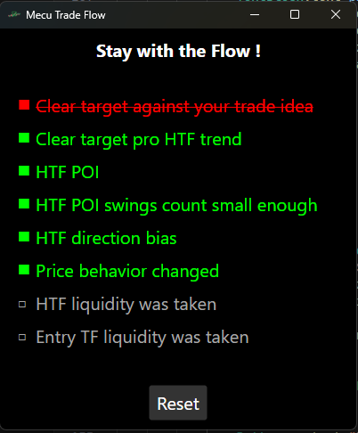

# CheckList - Mecu Trade Flow

A simple checklist application built with F# and Avalonia UI for tracking trading setups.

## Screenshot



## YouTube description on how to use


## Features

*   Three-state checkboxes: Not Pressed, Validated, and Invalidated.
*   Load phrases from a text file (`phrases.txt`).
*   Reset button to clear all selections.
*   Simple and clean user interface.

## Getting Started

### Prerequisites

*   .NET SDK (version 6.0 or later)

### Installation

1.  Clone the repository:

    ```bash
    git clone https://github.com/[your-username]/CheckList.git
    cd CheckList
    ```

2.  Build the project:

    ```bash
    dotnet build
    ```

### Usage

1.  Run the application:

    ```bash
    dotnet run
    ```

2.  The application will start, displaying a window with a list of phrases and checkboxes.

3.  Click on a phrase to toggle its state:

    *   Not Pressed (□) -> Invalidated (■ with strikethrough)
    *   Invalidated (■ with strikethrough) -> Validated (■)
    *   Validated (■) -> Not Pressed (□)

4.  Click the "Reset" button to reset all phrases to the "Not Pressed" state.

5.  You can customize the phrases by editing the `phrases.txt` file. Place each phrase on a new line.

### Customization

*   **Phrases:** Edit the `phrases.txt` file to customize the checklist items.
*   **Styling:** Modify the XAML in the `view` function to change the appearance of the application.
*   **Logic:** Adjust the `update` function to modify the application's behavior.

## License

This project is licensed under the MIT License - see the [LICENSE](LICENSE) file for details.

## Contributing

Contributions are welcome! Please feel free to submit pull requests or open issues to suggest improvements or report bugs.

## Acknowledgments

*   [Elmish](https://github.com/elmish/elmish): For the Elm-like architecture in F#.
*   [Avalonia UI](https://www.avaloniaui.net/): For providing a cross-platform UI framework.
*   [Avalonia.FuncUI](https://github.com/AvaloniaCommunity/Avalonia.FuncUI): For making Avalonia UI development with F# even more pleasant.